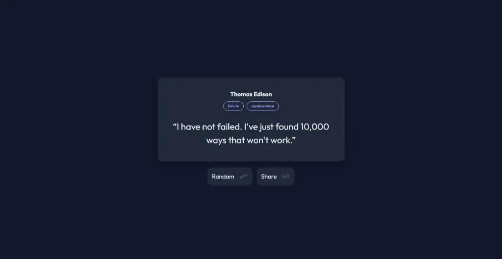

<!-- Please update value in the {}  -->

<h1 align="center">Random Quote Generator | devChallenges</h1>

   Solution for a challenge <a href="https://devchallenges.io/challenge/random-quote" target="_blank">Random Quote
</a> from <a href="http://devchallenges.io" target="_blank">devChallenges.io</a>.

  <h3>
    <a href="https://zakaria-guenifi.github.io/random-quote-generator/">
      Demo
    </a>
     | 
    <a href="https://github.com/zakaria-guenifi/random-quote-generator">
      Solution
    </a>
     | 
    <a href="https://devchallenges.io/challenge/random-quote">
      Challenge
    </a>
  </h3>

<!-- TABLE OF CONTENTS -->

## Table of Contents

- [Overview](#overview)
  - [What I learned](#what-i-learned)
- [Built with](#built-with)
- [Features](#features)
- [Contact](#contact)

<!-- OVERVIEW -->

## Overview

This was a nice project to do. Fetching the quotes from an API seems hard at first, but it is not once you get into it. It becomes a matter of optimization and performance once you get the hang of it. I also like adding the small details that enhance the experience, like the accessibility features and the interactivity nuances.

### What I learned

I learned a lot about interactivity and dealing with fetched data. I focused on making the API call perform well by calling it only the first time and then using that data to generate the random quotes, considering the API gave the same quotes, so it is unnecessary to call it on every button click.

### Built with

- Semantic HTML5 markup
- CSS custom properties
- Flexbox
- CSS Grid
- Vanilla JS

## Features

I added a few features that weren’t part of the original challenge:

- Support for screen readers so the quote and author are announced as they change

- Pressing the Space key to generate a new quote

- A popup that appears only once after the first random button click, disappearing after 4 seconds or when the user clicks on it

- A share button that copies both the quote and the author together

This application/site was created as a submission to a [DevChallenges](https://devchallenges.io/challenges-dashboard) challenge.

## Author

- Website [guenifi.com](https://guenifi.com)
- GitHub [@zakaria-guenifi](https://github.com/zakaria-guenifi)
